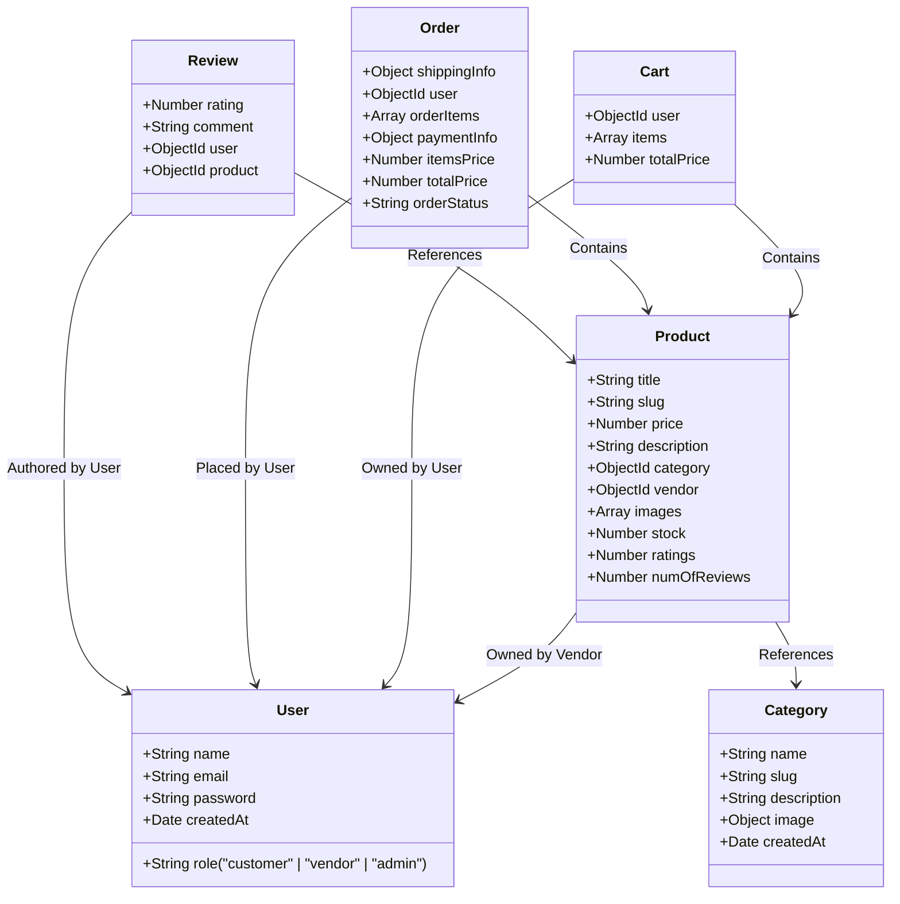

# 🛍️ Sahayak — Multi-Vendor Marketplace Platform

Sahayak is a premium, state-of-the-art multi-vendor e-commerce marketplace platform designed to empower independent sellers and provide a seamless shopping experience for customers. Built on a modern, robust MERN architecture (Vite, Express, Node.js, and MongoDB), Sahayak features secure checkout powered by Razorpay, automated product caching, Cloudinary image streaming, and interactive dashboards.

---

## 🚀 Key Features

### 🛒 Customer Experience
* **Interactive Explore Catalog**: Filter products by category, search with instant fuzzy match queries, and view ratings/stock counts.
* **Persistent Shopping Cart**: Automated backend totals calculations with pre-save database hooks.
* **Secure Razorpay Payment Integration**: Integrated step-by-step checkout modal with signature verification.
* **Review & Rating Engine**: Users can leave single-constrained reviews per product. Product average ratings and review counts auto-recalculate on insertion/deletion using MongoDB pre/post save hooks.

### 🏪 Vendor Capabilities
* **Storefront Management**: Dedicated dashboards to view order metrics and register new items.
* **Seamless Media Uploads**: Multipart product uploads parsed on the server and piped directly to Cloudinary.
* **Order Fulfillment Pipeline**: Vendor-isolated shipment pipelines to update order statuses (`Processing` ➔ `Shipped` ➔ `Delivered`) and automate inventory stock management.

### 🛡️ Core Infrastructure & Security
* **Performance Caching**: Integrated `node-cache` layer in product queries with a standard TTL of 5 minutes to minimize database queries.
* **Strict Authentication & RBAC**: Password hashing via Bcrypt, stateless authentication via JWT, and Role-Based Access Control (`customer`, `vendor`, `admin`).
* **Enhanced Security**: API Rate limiting, CORS configuration, and security headers configured via Helmet.

---

## 📂 Project Architecture

```bash
sahayak/
├── backend/                  # Express.js REST API Server
│   ├── config/               # Database and Cloudinary SDK configuration
│   ├── controllers/          # Business logic handlers for each resource
│   ├── middleware/           # Auth validation, role authorization, file parsing
│   ├── models/               # MongoDB Mongoose schemas
│   ├── routes/               # API route definitions
│   ├── utils/                # Cloudinary image uploader stream engine
│   ├── .env                  # Server environment variables
│   ├── seed.js               # Database initialization script
│   └── server.js             # Express application root entrypoint
│
└── frontend/                 # React.js Client Application
    ├── public/               # Static assets
    ├── src/                  # Client source code
    │   ├── components/       # Layouts, Navbar, Providers wrapper
    │   ├── pages/            # View pages (Home, Explore, Details, Dashboard)
    │   ├── services/         # Axios instance & API interceptors
    │   ├── store/            # State management with Zustand (auth, cart, theme)
    │   ├── App.jsx           # Client router definitions
    │   ├── globals.css       # Tailwind CSS root configurations
    │   └── main.jsx          # Client DOM mount entrypoint
    ├── vite.config.js        # Vite compilation configurations
    └── tailwind.config.js    # Styling layout configs
```

---

## 🛠️ Technology Stack

| Domain | Technology | Description |
| :--- | :--- | :--- |
| **Frontend Core** | React 19 + Vite | Ultra-fast client-side compile & rendering engine |
| **Frontend Styling** | Tailwind CSS v4 | Harmonious, modern dark-mode enabled design system |
| **State Management**| Zustand + Persist | Client-side store management with automatic LocalStorage sync |
| **Server State** | Tanstack React Query | Declarative backend caching & queries on the frontend |
| **Backend Core** | Express 5 + Node.js | Scalable API request-response structure |
| **Database ORM** | Mongoose + MongoDB | Object modeling for asynchronous node environments |
| **Storage** | Multer + Cloudinary | Memory buffer stream upload engine |
| **Payments** | Razorpay SDK + Web Checkout | Realtime transaction management with cryptographically secure signatures |

---

## 🔌 API Endpoints Documentation

All base requests are rooted at `http://localhost:5000/api`.

### 🔐 Authentication (`/api/auth`)
* `POST /api/auth/signup` - Register new customer, vendor, or admin.
* `POST /api/auth/login` - Authenticate credentials and receive a JWT.
* `GET /api/auth/profile` - *[Protected]* Returns profile information of current logged-in user.

### 🏷️ Categories (`/api/categories`)
* `GET /api/categories` - Fetch list of active product categories.
* `POST /api/categories` - *[Protected - Admin]* Register a new category.
* `DELETE /api/categories/:id` - *[Protected - Admin]* Remove a category.

### 📦 Products (`/api/products`)
* `GET /api/products` - Paginated & cached list of products. (Filters: `?keyword=`, `?category=`, `?minPrice=`, `?maxPrice=`, `?page=`, `?limit=`).
* `GET /api/products/:id` - Fetch details of a single product.
* `POST /api/products` - *[Protected - Vendor/Admin]* Upload new product + images (supports `multipart/form-data` with up to 5 images).
* `DELETE /api/products/:id` - *[Protected - Vendor/Admin]* Deletes product. (Vendor can only delete their own products).

### 🛒 Shopping Cart (`/api/cart`)
* `GET /api/cart` - *[Protected]* Fetch active shopping cart.
* `POST /api/cart` - *[Protected]* Add or update items in cart. (Body: `{ productId, quantity }`).
* `DELETE /api/cart` - *[Protected]* Remove all items from cart.
* `DELETE /api/cart/:productId` - *[Protected]* Remove specific item from cart.

### 💳 Payments (`/api/payment`)
* `GET /api/payment/config` - *[Protected]* Retrieves Razorpay Public Key ID securely.
* `POST /api/payment/create-order` - *[Protected]* Instantiates a secure Razorpay order matching the Sahayak order total amount.
* `POST /api/payment/verify` - *[Protected]* Validates HMAC-SHA256 signature returned by Razorpay. On success, updates order payment status to `Paid`.

### 📦 Orders & Shipments (`/api/orders`)
* `POST /api/orders` - *[Protected]* Post checkout details to place order. Clears cart upon completion.
* `GET /api/orders/my-orders` - *[Protected - Customer]* Retrieves order histories.
* `GET /api/orders/vendor` - *[Protected - Vendor]* Retrieves orders containing products owned by the vendor.
* `GET /api/orders/:id` - *[Protected]* Retrieve specific order details (Authorized for buyer, seller, and Admins).
* `PUT /api/orders/:id/status` - *[Protected - Vendor/Admin]* Update shipment status. Marking status as `Delivered` automatically decrements product stock.

### 💬 Reviews & Ratings (`/api/reviews`)
* `POST /api/reviews` - *[Protected - Customer]* Leave product review. (Enforces limit of one review per user per product).
* `GET /api/reviews/:productId` - Retrieve all reviews left for a specific product.
* `DELETE /api/reviews/:id` - *[Protected]* Remove a review. (Allowed only for author or Admin).

---

## 💾 Database Models Schema



---

## ⚡ Setup & Run Instructions

### 1. Prerequisites
Ensure you have Node.js (v18+) and a MongoDB Atlas Database cluster or Local MongoDB instance running.

### 2. Environment Variables Configuration
Create a `.env` file in the `/backend` directory:
```env
PORT=5000
MONGO_URI=mongodb+srv://<username>:<password>@cluster.mongodb.net/sahayak
JWT_SECRET=your_jwt_secret_key_here

CLOUDINARY_CLOUD_NAME=your_cloudinary_name
CLOUDINARY_API_KEY=your_cloudinary_key
CLOUDINARY_API_SECRET=your_cloudinary_secret

RAZORPAY_KEY_ID=your_razorpay_key_id
RAZORPAY_KEY_SECRET=your_razorpay_key_secret
```

### 3. Initialize & Populate Database
Run the database seed script to populate sample accounts, categories, and items.
```bash
cd backend
npm install
node seed.js
```
*Note: This script will create a vendor login for testing:*
* **Email**: `seller@sahayak.com`
* **Password**: `password123`

### 4. Running Backend Local Server
```bash
cd backend
npm run dev
```
The backend server will run on `http://localhost:5000`.

### 5. Running Frontend Client Application
```bash
cd frontend
npm install
npm run dev
```
The Vite development server will spin up on `http://localhost:5173`. Open this URL in your web browser.

---

## ⚡ Developer Guidelines

1. **Authentication Interceptor**: All frontend HTTP requests use the custom Axios instance in [api.js](file:///c:/Users/THE%20TRUSTLESS/sahayak/frontend/src/services/api.js). It automatically extracts the JWT token from the Zustand store and injects it into headers as `Authorization: Bearer <token>`.
2. **Auto-Logout**: If the backend rejects a query with a `401 Unauthorized` status (e.g. token expired), the Axios response interceptor automatically triggers a logout state reset.
3. **Data Caching**: Keep `stdTTL` configurations aligned in [productController.js](file:///c:/Users/THE%20TRUSTLESS/sahayak/backend/controllers/productController.js). Ensure modifications to product properties (like deletion or stock updates) invalidate or refresh cached endpoints.
